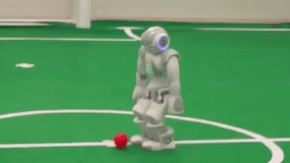
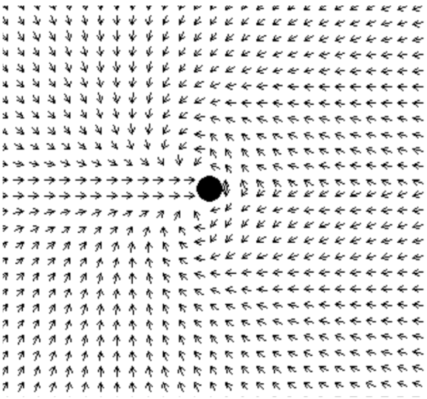

# GER Very Small Size Soccer - Remote Edition 🦠

Repositório de código direcionado à competição na categoria de Very Small Size Soccer(VSSS) produzido pelo Grupo de Estudos em Robótica da Unicamp(GER).

## Pré-requisitos
Alguns pré-requisitos são necessários para se compilar e executar o projeto. Para evitar conflitos entre os pré-requisitos e agilizar o processo, recomendamos o uso do Docker.

Os pré-requisitos não são descritos aqui pois são gerenciados pelo Docker, o que permite a abstração do processo de configuração e evita tecnicalidades e problemas encontrados ao se tentar configurar o ambiente em diferentes sistemas operacionais com diferentes versões de pré-requisitos.

### Docker
Docker é um conjunto de produtos de plataforma como serviço que usam virtualização de nível de sistema operacional para entregar software em pacotes chamados *containers*. Os *containers* são isolados uns dos outros e agrupam seus próprios softwares, bibliotecas e arquivos de configuração.

*Containers* permitem utilizar o hardware de seu próprio computador, diferente de máquinas virtuais, que virtualizam o *hardware*. Outra vantagem em relação às VMs, é o menor uso de memória e a velocidade de um *container*.

Utilizamos *containers* para trabalhar em um ambiente controlado, evitando conflitos entre versões dos pré-requisitos ou a falta deles em sua máquina local. 

**Para configurar o Docker, veja nosso manual disponível neste repositório:**
[VSSSDocker](https://github.com/ger-unicamp/VSSSDocker).

**Observações importantes:**
Por enquanto, mesmo utilizando o Docker, nossa solução não funciona para MacOS. Isso se deve ao fato do hardware proprietário da placa de vídeo impedir alguns acessos importantes ao se utilizar a biblioteca OpenGL. Recomendamos a utilização do Docker em máquina virtual GNU/Linux para contornar este problema.

## Compilação
Para compilar o código, blablabla

## Execução
Para executsar o código blablabla

## Componentes
O código é dividido das seguinte maneira:

- **TODO:** Fazer o diagrama de componentes

Os componentes são descritos à seguir:

### net

Contém os métodos que conectam o FiraSim ao nosso código pela rede. A conexão é estabelescida utilizando UDP, como um broadcast, sem confirmação da recepção das mensagens. 

### pb

Protocol Buffers (Protobuf) é um método de serialização de dados estruturados. É útil no desenvolvimento de programas que se comunicam uns com os outros ou para armazenar dados. É uma das alternativas ao XML/JSON. A pasta **pb** contém arquivos que definem os protobufs utilizados no projeto.

A pasta **proto** descreve as mensagens enviadas e recebidas entre o FiraSim e nosso código. Cada mensagem tem uma estrutura diferente documentada em sua própria pasta. 

Exemplos de mensagens são:

- Enviar ao FiraSim informações sobre o reposicionamento dos robôs após uma falta.
- Receber a posição da bola e dos robôs no campo.
- Intervenções do juiz no jogo.

### strategy

Contém métodos uteis que definem a estratégia do jogo, além de métodos adicionais para detectar objetos no campo e iniciar partidas.

A estratégia se utiliza de *univector potential fields*, basicamente campos vetoriais que guiam os robôs até a bola, desviando de obstáculos. A bola emite um campo atrativo, enquanto os robôs emitem campos repulsivos, para evitar colisões.

O processo é melhor descrito no seguinte paper:
[Univector Field Navigation With Collision Avoidance](./doc/UnivectorFieldNavigationWithCollisionAvoidance.pdf)

### train

Contém arquivos relacionados ao algoritmo genérico utilizado para otimizar os parâmetros do campo vetorial.

- **TODO:** Descrever os cromossomos
- **TODO:** Descrever fitness function
- **TODO:** Descrever como treinar

O algoritmo evolucionário também é descrito no paper:
[Univector Field Navigation With Collision Avoidance](./doc/UnivectorFieldNavigationWithCollisionAvoidance.pdf)

### util

Contém métodos gerais que sejam úteis.

- **argparse:** trata os argumentos passados por linha de comando.
- **mathutil:** métodos matemáticos úteis.
- **timer:** define métodos para o timer global.
- **util:** outros métodos gerais. Funções matemáticas, operações bitwise, cálculo com ângulos, estruturas de dados, acesso à memória, entre outros.
- **vec2:** representa o tipo vec2, para vetores no espaço ℝ2. Define operações vetoriais, como produto escalar e normalização.

## Classes e Objetos

### [Game](src/strategy/Game.cpp)
Contém métodos relacionados ao jogo. Atribuição de times, inicialização de partidas, reposicionamento no campo, entre outros

- **TODO:** fazer diagrama da classe

### Univector
Descreve métodos relacionados aos campos vetoriais. Define e combina os campos vetoriais gerados pelos robôs e pela bola. Movimenta cada robô de acordo com o campo vetorial combinado e sua posição (x,y).

- **TODO:** fazer diagrama da classe

### Referee

- **TODO:** descrever a classe
- **TODO:** fazer diagrama da classe

